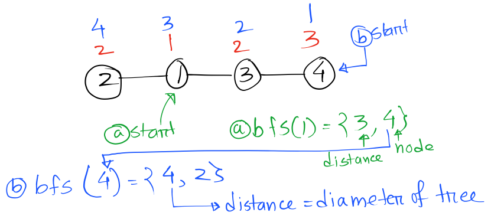

#### Diameter of a Tree

Source: [Quora](https://www.quora.com/How-do-I-find-the-diameter-of-a-tree),

It is the longest path between two nodes in a tree **(longest path includes the source and destination).** The diameter of a tree is the number of nodes on the longest path between two leaves in the tree. The following picture for Explanation has a diameter of $4$.

#### Algorithm - 1: Using BFS/DFS

```cpp
vector<vector<int> > g;
int n;
pair<int, int> bfs(int root){
    vector<int> dist(n+1, 0);
    dist[root] = 1;
    queue<int> q;
    q.push(root);
    while(!q.empty()){
        int curr = q.front();
        for(auto it : g[curr]){
            if(dist[it] != 0){
                continue;
            }
            q.push(it);
            dist[it] = dist[curr] + 1;
        }
        q.pop();
    }
    int mx = INT_MIN, vertex = -1;
    for(int i=1 ; i<=n ; i++){
        if(mx < dist[i]){
            mx = dist[i];
            vertex = i;
        }
    }
    return make_pair(mx, vertex);
}
int diameter(int root){
    pair<int, int> p1 = bfs(root), p2;
    p2 = bfs(p1.second);
    return p2.first;
}
int main(){
    cin >> n;
    g.resize(n+1);
    for(int i=0, u, v ; i<n-1 ; i++){
        cin >> u >> v;
        g[u].push_back(v);
        g[v].push_back(u);
    }
// choosing arbitrary node to be 1.
    cout << diameter(1) ;
    return 0;
}
```

```
Time Complexity: O(n)
```

**Explanation:**



- For the above graph I start bfs on a arbitrary node let's say 1. So I do `diameter(1)` $\Rightarrow$ `bfs(1)` which returns me node $4$ with the highest distance 3 (red color).
- Now I do `bfs(4)` because 4 was returned previously and now `bfs(4)` returns me node $1$ with the hight distance of $4$ ($\text{Blue Color}$).
- Now 4 is the answer to this graph. The longest path is from $2$ to $4$ and there lies 4 nodes within this path: $2, 1, 3, 4$
