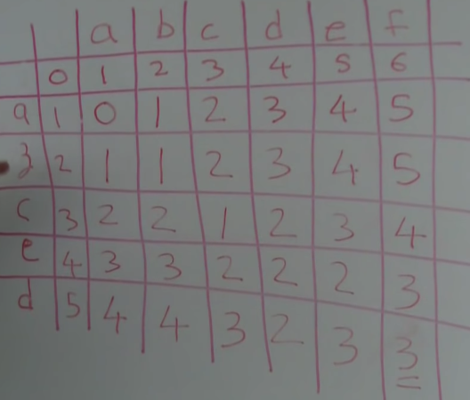

### Edit Distance

Minimum number of steps needed to convert one string into another one.

Source:

- [Edit Distance of two strings - Real world application](https://www.youtube.com/watch?v=XJ6e4BQYJ24&t=267s) Watch the whole video
- [Minimum Edit Distance Dynamic Programming](https://www.youtube.com/watch?v=We3YDTzNXEk) Watch the first 2 minutes

- **Summary**:

  - You've three options:
    - Add a character with cost $C_A$
    - Remove/Delete a character with cost $C_D$
    - Change/Transit a character with cost $C_T$
  - Let's say `s2 = 'abcde'`, `s2 = 'abcdx'`
    Now ,

    ```cpp
    if: (s1[i = 4] != s2[j = 4]): they don't match
    {

        F(s1, s2) = min ({
          F("abcde$", s2) + C_A, // Adding a character
          F("abcd", s2) + C_D, // Deleting a character,
          F("abcd`x`", "abcd`x`") + C_T, // Transition
        });
        // OR //
        F(i, j) = min ({
          F(i + 1, j) + C_A, // Adding a character
          F(i-1, j) + C_D, // Deleting a character,
          F(i-1, j-1) + C_T, // Transitioning
        });
        // OR //
        F(i + 1, j) + C_A, // Adding a character
        (i + 1):: you can't look in the future, we'll add a character to so that
        it matches with the other character in other string. So it means adding a
        character is effectively removing a character from the other string.
        // OR //
        F(i, j-1) + C_A, // Adding a character
        F(i-1, j) + C_D, // Deleting a character,
        F(i-1, j-1) + C_T, // Transitioning
    }
    else: (if they match, get the best answer without considering them)
        F(s1, s2) = min ('abcd', 'abcd')
    ```

  - Now Initially, the table looks like this:
    
    `dp[0][4] = 4`, it means if we have the string `"abcd"` and a null string`" "`, we'll have to take 4 steps to convert the string.
    `dp[3][0] = 3`, it means if we've string `"abc"` and a **null** string `" "`, we'll have to take 3 steps to convert the string.

Source code:

```cpp
using namespace std;
using ll = long long;
const int SIZE = 1e3;
int dp[SIZE][SIZE];

void print(int n1, int n2) {
    for (int i = 0; i <= n1; ++i) {
        for (int j = 0; j <= n2; ++j) {
            printf("%3d", dp[i][j]);
        }
        cout << endl;
    }
    cout << endl;
}

int main() {
    ios_base::sync_with_stdio(false);
    cin.tie(NULL); cout.tie(NULL);

    string s1 = "abcdef";
    string s2 = "azced";

    int n2 = (int) s1.length();
    int n1 = (int) s2.length();

    // n2 -- (i) ===> first string -->  spread across the first row
    // n1 -- (j) ===> second string --> spread across the first column

    s1 = '#' + s1;
    s2 = '#' + s2;

    int C_A = 1;
    int C_D = 1;
    int C_T = 1;

    memset(dp, 0, sizeof(dp));

    for (int i = 0; i <= n1; ++i) dp[i][0] = i;
    for (int i = 0; i <= n2; ++i) dp[0][i] = i;

    for (int i = 1; i <= n1; ++i) {
        for (int j = 1; j <= n2; ++j) {
            if (s1[j] != s2[i]) dp[i][j] = min({
                    dp[i][j-1] + C_A, // Add
                    dp[i-1][j] + C_D, // Remove
                    dp[i-1][j-1] + C_T // Transition
                    });
            else dp[i][j] = dp[i-1][j-1];
        }
    }

    print(n1, n2);

    cout << "----SOLUTION FOR : S2 to S1----" << endl;
    int i = n1; // string2
    int j = n2; // string1
    while (i >= 0 && j >= 0 && dp[i][j]) {
        if (s1[j] == s2[i]) {
            i -= 1; j -= 1;
            // ignore the character, because they've matched
        } else {
            if (dp[i-1][j-1] + 1 == dp[i][j]) {
                // transition occured here becase of i-1, j-1
                cout << "Change " << s2[i] << " to " << s1[j] << " in s2" << endl;
                i -= 1; j -= 1;
            }
            else if (dp[i-1][j] + 1 == dp[i][j]) {
                cout << "Deleted the character: " << s2[i] << " from s2" << endl;
                i -= 1;
            }
            else if (dp[i][j-1] + 1 == dp[i][j]) {
                cout << "Add character: " << s1[j] << " in S2 at before: " << i << endl;
                j -= 1;
            }
        }
    }
    cout << endl;

    cout << "----SOLUTION FOR : S1 to S2----" << endl;
    i = n1; // string2
    j = n2; // string1
    while (i >= 0 && j >= 0 && dp[i][j]) {
        if (s1[j] == s2[i]) {
            i -= 1; j -= 1;
            // ignore the character, because they've matched
        } else {
            if (dp[i-1][j-1] + 1 == dp[i][j]) {
                // transition occured here becase of i-1, j-1
                cout << "Change " << s1[j] << " to " << s2[i] << " in s1" << endl;
                i -= 1; j -= 1;
            }
            else if (dp[i-1][j] + 1 == dp[i][j]) {
                cout << "Add character: " << s2[i] << " in S1 at before: " << j << endl;
                i -= 1;
            }
            else if (dp[i][j-1] + 1 == dp[i][j]) {
                cout << "Deleted the character: " << s1[j] << " from s1" << endl;
                j -= 1;
            }
        }
    }
    cout << endl;

    cout << "ANS: " <<  dp[n1][n2] << endl;
}
```
