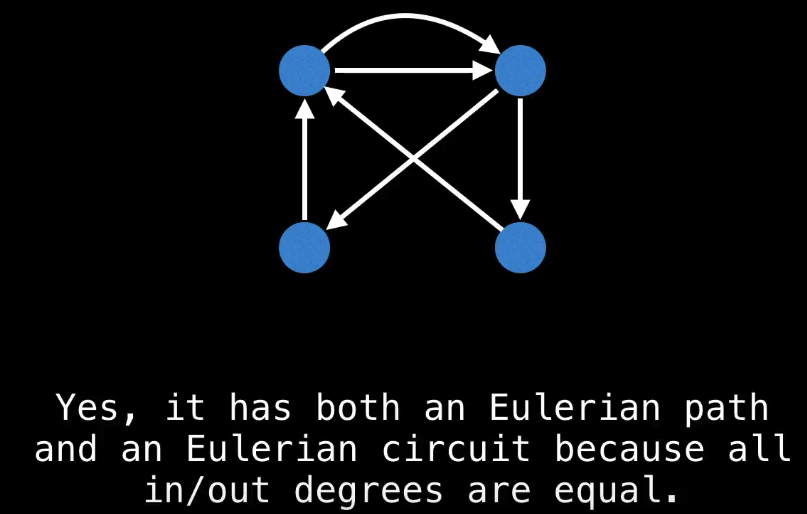
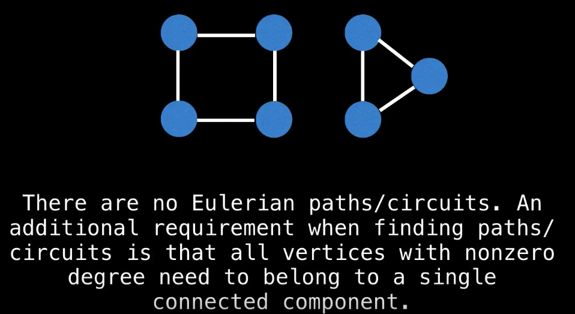
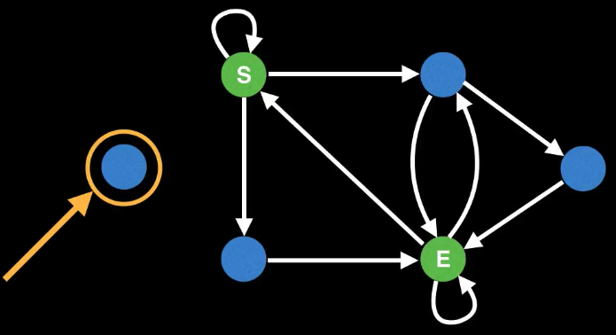
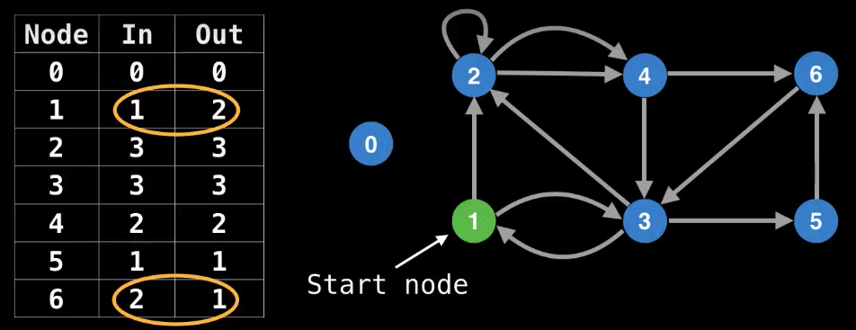

#### Eulerian Path and Circuits:

source: [WilliamFiset](https://www.youtube.com/watch?v=xR4sGgwtR2I&index=19&list=PLDV1Zeh2NRsDGO4--qE8yH72HFL1Km93P)

**Eulerian Path:** Traverse all the edges exactly once.

**Eulerian Circut:** Traverse all the edges exactly once and end up at the starting node.

|                      | Eulerian Circuit                                                                                                                                                                                                                                                                                                   | Eulerian Path                                                                                                                                                              |
| -------------------- | ------------------------------------------------------------------------------------------------------------------------------------------------------------------------------------------------------------------------------------------------------------------------------------------------------------------ | -------------------------------------------------------------------------------------------------------------------------------------------------------------------------- |
| **Undirected graph** | Every vertex has an **even** degree                                                                                                                                                                                                                                                                                | Either every vertex has even degree or exactly two vertices have odd degree                                                                                                |
| **directed graph**   | Every Vartex has equal indegree and outdegree. Let $V \in G$, then for all $V$, **$(In)_V = (OUT)_V$**<br>Let me be clearer. Let $x$ and $y$ be two vertices. Then we only need to worry about $(IN)_X = (OUT)_X$ and $(IN)_Y = (OUT)_Y$ and not $(IN)_X = (IN)_Y$ or $(OUT)_X = (OUT)_Y$ <br>  | At most one vertex has $\text{outdegree - indegree = 1}$ and at most one vertex has $\text{indegree - outdegree = 1}$ and all other vertices have equal in and out degree. |
|                      |                                                                                                                                                                                                                                                                                                                    |                                                                                                                                                                            |

> If a graph has an Eulerian Circuit then the graph also has an Eulerian Path too.




This graph has an Eulerian path, but no Eulerian Curcit. It also has a unique start/end node for the path. Note that, the singleton node on the left has no incoming/outgoing edges, so it doesn't impact whether or not we have an Eulerian path. [Maybe it doesn't count as a separate connected components]

#### Finding an Eulerian Path:



- **Node 1** is the only node with exactly one extra outgoing edge, so it's our only valid **start node**. Similarly, **node 6** is the only node with exactly one extra incoming edge, so it will end up being the **end node**. All other nodes have equal in and out degree. Therefore there exists a Eulerian Path in this graph, but no eulerian circuit.

- In Case all the nodes had same in and out degree, then it would be a Eulerian Circuit, and thus an Eulerian Path would exist. But then we don't have any designated start and end node.

* **Note:** If in and out degrees of all the nodes are equal (Eulerian Circuit case) then any node with **non-zero** degree would server as a suitable **starting node**.

```java
/**
 * Implementation of finding an Eulerian Path on a graph. This implementation
 * verifies that the input graph is fully connected and supports self loops
 * and repeated edges between nodes.
 *
 * Test against:
 * https://open.kattis.com/problems/eulerianpath
 * http://codeforces.com/contest/508/problem/D
 *
 * Time Complexity: O(E)
 *
 * @author William Fiset, william.alexandre.fiset@gmail.com
 */
package com.williamfiset.algorithms.graphtheory;

import java.util.ArrayList;
import java.util.Arrays;
import java.util.List;
import java.util.LinkedList;

public class EulerianPathDirectedEdgesAdjacencyList {

  private final int n;
  private int edgeCount;
  private int[] in, out;
  private LinkedList<Integer> path;
  private List<List<Integer>> graph;

  public EulerianPathDirectedEdgesAdjacencyList(List<List<Integer>> graph) {
    if (graph == null)
      throw new IllegalArgumentException("Graph cannot be null");
    n = graph.size();
    this.graph = graph;
    path = new LinkedList<>();
  }

  // Returns a list of edgeCount + 1 node ids that give the Eulerian path or
  // null if no path exists or the graph is disconnected.
  public int[] getEulerianPath() {
    setUp();
    if (edgeCount == 0) return null;

    if (!graphHasEulerianPath()) return null;
    dfs(findStartNode());

    // Make sure all edges of the graph were traversed. It could be the
    // case that the graph is disconnected in which case return null.
    if (path.size() != edgeCount+1) return null;

    // Instead of returning the 'path' as a linked list return
    // the solution as a primitive array for convenience.
    int[] soln = new int[edgeCount+1];
    for(int i = 0; !path.isEmpty(); i++)
      soln[i] = path.removeFirst();

    return soln;
  }
  private void setUp() {
    // Arrays that track the in degree and out degree of each node.
    in  = new int[n];
    out = new int[n];

    edgeCount = 0;

    // Compute in and out node degrees.
    for (int from = 0; from < n; from++) {
      for (int to : graph.get(from)) {
        in[to]++;
        out[from]++;
        edgeCount++;
      }
    }
  }
  private boolean graphHasEulerianPath() {
    int startNodes = 0, endNodes = 0;
    for (int i = 0; i < n; i++) {
      if (out[i] - in[i] > 1 || in[i] - out[i] > 1) return false;
      else if (out[i] - in[i] == 1) startNodes++;
      else if (in[i] - out[i] == 1) endNodes++;
    }
    return (endNodes == 0 && startNodes == 0) ||
           (endNodes == 1 && startNodes == 1);
  }
  private int findStartNode() {
    int start = 0;
    for (int i = 0; i < n; i++) {
      // Unique starting node.
      if (out[i] - in[i] == 1) return i;

      // Start at a node with an outgoing edge.
      if (out[i] > 0) start = i;
    }
    return start;
  }
  // Perform DFS to find Eulerian path.
  private void dfs(int at) {
    while(out[at] != 0) {
      int next = graph.get(at).get(--out[at]);
      dfs(next);
    }
    path.addFirst(at);
  }

    /* Graph creation helper methods */

  public static List<List<Integer>> initializeEmptyGraph(int n) {
    List<List<Integer>> graph = new ArrayList<>(n);
    for (int i = 0; i < n; i++)
      graph.add(new ArrayList<>());
    return graph;
  }

  public static void addDirectedEdge(List<List<Integer>> g, int from, int to) {
    g.get(from).add(to);
  }

    /* Examples */

  public static void main(String[] args) {
    exampleFromSlides();
    // smallExample();
  }

  private static void exampleFromSlides() {
    int n = 7;
    List<List<Integer>> graph = initializeEmptyGraph(n);

    addDirectedEdge(graph, 1, 2);
    addDirectedEdge(graph, 1, 3);
    addDirectedEdge(graph, 2, 2);
    addDirectedEdge(graph, 2, 4);
    addDirectedEdge(graph, 2, 4);
    addDirectedEdge(graph, 3, 1);
    addDirectedEdge(graph, 3, 2);
    addDirectedEdge(graph, 3, 5);
    addDirectedEdge(graph, 4, 3);
    addDirectedEdge(graph, 4, 6);
    addDirectedEdge(graph, 5, 6);
    addDirectedEdge(graph, 6, 3);

    EulerianPathDirectedEdgesAdjacencyList solver;
    solver = new EulerianPathDirectedEdgesAdjacencyList(graph);

    // Outputs path: [1, 3, 5, 6, 3, 2, 4, 3, 1, 2, 2, 4, 6]
    System.out.println(Arrays.toString(solver.getEulerianPath()));
  }

  private static void smallExample() {
    int n = 5;
    List<List<Integer>> graph = initializeEmptyGraph(n);

    addDirectedEdge(graph, 0, 1);
    addDirectedEdge(graph, 1, 2);
    addDirectedEdge(graph, 1, 4);
    addDirectedEdge(graph, 1, 3);
    addDirectedEdge(graph, 2, 1);
    addDirectedEdge(graph, 4, 1);

    EulerianPathDirectedEdgesAdjacencyList solver;
    solver = new EulerianPathDirectedEdgesAdjacencyList(graph);

    // Outputs path: [0, 1, 2, 1, 4, 1, 3]
    System.out.println(Arrays.toString(solver.getEulerianPath()));
  }

}
```

```cpp
************ NOT TESTED YET **********
struct EulerianPathDirectedEdgesAdjacencyList {
    int n, edgeCount;
    vector<int> in, out;
    vector<int> path;
    vector<vector<int> > graph;

public:
    EulerianPathDirectedEdgesAdjacencyList(vector<vector<int>> g) {
        if (g.size() == 0) { }
        n = g.size();
        this->graph = g;
        in.resize(n, 0);
        out.resize(n, 0);
    }
    vector<int> getEulerianPath() {
        setup();
        if (edgeCount == 0) {}
        if (!graphHasEulerianPath()) {
            cout << "NO EULERIAN PATH" << endl;
            return vector<int>{-1};
        }
        dfs (findStartNode());
        if ((int) path.size() != edgeCount + 1) {
            cout << "NO EULERIAN PATH" << endl;
            return vector<int>{-1};
        }

        return path;
    }

    void setup() {
        edgeCount = 0;
        for (int i = 0; i < n; ++i) {
            for (int j : graph[i]) {
                ++in[j];
                ++out[i];
                ++edgeCount;
            }
        }
    }

    bool graphHasEulerianPath() {
        int startNodes = 0, endNodes = 0;
        for (int i = 0; i < n; ++i) {
            if (out[i] - in[i] > 1 || in[i] - out[i] > 1) return false;
            else if (out[i] - in[i] == 1) ++startNodes;
            else if (in[i] - out[i] == 1) ++endNodes;
        }
        return (endNodes == 0 && startNodes == 0) ||
                (endNodes == 1 && startNodes == 1);
    }

    int findStartNode() {
        int start = 0;
        for (int i = 0; i < n; ++i) {
            if (out[i] - in[i] == 1) return i;
            if (out[i] > 0) start = i;
        }
        return start;
    }

    void dfs (int at) {
        while (out[at]) {
            int next = graph[at][--out[at]];
            dfs(next);
        }
        path.push_back(at);
    }

};

int main() {
    ios_base::sync_with_stdio(false);
    cin.tie(NULL); cout.tie(NULL);

    int n, e;
    cin >> n >> e;
    vector<vector<int>> v(n);

    for (int i = 0, a, b; i < e; ++i) {
        cin >> a >> b;
        v[a].push_back(b);
    }


    EulerianPathDirectedEdgesAdjacencyList ans = EulerianPathDirectedEdgesAdjacencyList(v);
    vector<int> out = ans.getEulerianPath();

    for (auto i : out) cout << i << " "; cout << endl;


    return 0;
}
```
