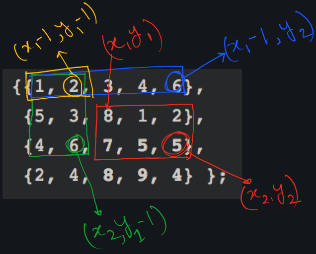

### Matrix Sum

In the following picture, the co-ordinates are shown in the input matrix and not in the sum matrix.


```cpp
const int M = 5;
const int N = 4;
int sumQuery(int aux[N][M], int x1, int y1, int x2,
              int y2)
{
    // result is now sum of elements between (0, 0) and
    // (x2, y2)
    int res = aux[x2][y2];

    // Remove elements between (0, 0) and (x1-1, y2)
    if (x1 > 0)
       res = res - aux[x1-1][y2];

    // Remove elements between (0, 0) and (x2, y1-1)
    if (y1 > 0)
       res = res - aux[x2][y1-1];

    // Add aux[x1-1][y1-1] as elements between (0, 0)
    // and (x1-1, y1-1) are subtracted twice
    if (x1 > 0 && y1 > 0)
       res = res + aux[x1-1][y1-1];

    return res;
}

int main() {
    ios_base::sync_with_stdio(false);
    cin.tie(NULL); cout.tie(NULL);

    int matrix[N][M] = {{1, 2, 3, 4, 6},
                        {5, 3, 8, 1, 2},
                        {4, 6, 7, 5, 5},
                        {2, 4, 8, 9, 4} };
    int sum[N][M] = {};
    sum[0][0] = matrix[0][0];

    for (int i = 1; i < M; ++i) sum[0][i] = matrix[0][i] + sum[0][i-1];
    for (int i = 1; i < N; ++i) sum[i][0] = matrix[i][0] + sum[i-1][0];

    for (int i = 1; i < N; ++i) {
        for (int j = 1; j < M; ++j) {
            int &sm = sum[i][j];
            sm = matrix[i][j];
            sm += sum[i-1][j];
            sm += sum[i][j-1];
            sm += sum[i-1][j-1];
            sm -= 2 * sum[i-1][j-1];
        }
    }
    cout << "SUM MATRIX:" << endl;
    for (int i = 0; i < N; ++i) {
        for (int j = 0; j < M; ++j) { cout << sum[i][j] << "\t"; }
        cout << endl;
    }

    int x1, x2, y1, y2;
    x1 = 1; y1 = 2; x2 = 2; y2 = 4;

    cout << sumQuery(sum, x1, y1, x2, y2) << endl;
    cout << sumQuery(sum, 2, 2, 2, 2) << endl;
}
```
