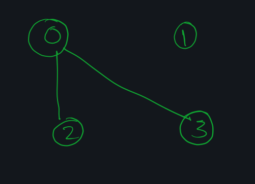

- **HR [The perfect XOR](https://www.hackerearth.com/practice/algorithms/graphs/articulation-points-and-bridges/practice-problems/algorithm/question-5-34/description/)**<br>
  I kinda cracked the solution. It's in the cp v-log folder in Connect Drive.

* **UVA 796**:<br>
  It's perfectly working for the debug test cases, ([code](https://paste.ubuntu.com/p/ycqJrN3yZW/)). I don't know where it's going wrong.

  - **Update**: It's working, reason being the same as the one below. [Solution](https://paste.ubuntu.com/p/g8t3NthG8X/)

* **UVA315:**<br>
  Articulation Point problem<br>
  Corner Case:

  ```
  7
  1 2 5 6
  2 4 5 6
  3 5 7
  4 5
  5 7
  0
  0
  ```

  Output of the above mentioned input should be `1`, the node `5` is the articulation point. But my [code](https://ideone.com/sxtwfZ) gives `0` as output. Maybe I did something wrong in my code.

  - **Update**: Well Now it's working, thanks to my stupid typing mistake. [Solution](https://paste.ubuntu.com/p/JMMTBBy7Mz/)

- **UVA11080:**<br>
  Bi-coloring problem: I need to cover every edge and vertex, using minimum vertexes.

  Corner Case:

  - The Output is 2, since 1 is a junction and it needs to be covered <br>
    

  - Output is 1 since it's still a vertex and needs to be covered.<br>
    
